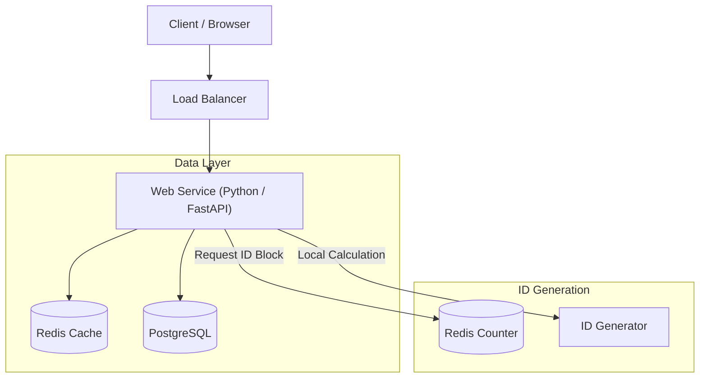

# System Design: Distributed URL Shortener (Python Edition)

## 1. Requirements

### Functional
- **Shorten URL**: Users can input a long URL and get a shorter, unique alias.
- **Redirection**: Accessing the short alias redirects to the original URL.
- **Custom Alias** (Optional): Users can request a specific custom alias.
- **Expiration** (Optional): Users can set an expiration time for the link.

### Non-Functional
- **High Availability**: The system should be highly available (e.g., 99.99%) for redirects.
- **Low Latency**: Redirection should happen in milliseconds (< 100ms).
- **Scalability**: Support billions of links and high read throughput (100:1 Read/Write ratio).
- **Durability**: Links should stay permanent (unless expired).

## 2. API Design

### REST Endpoints

1.  **Create Short URL**
    - `POST /api/v1/shorten`
    - **Request**:
        ```json
        {
          "long_url": "https://www.google.com/...",
          "custom_alias": "my-link", // Optional
          "expiration_date": "2025-12-31T23:59:59Z" // Optional
        }
        ```
    - **Response**: `201 Created`
        ```json
        {
          "short_url": "http://short.ly/abc1234",
          "short_code": "abc1234"
        }
        ```

2.  **Redirect**
    - `GET /:short_code`
    - **Response**: `302 Found` (Location: `long_url`)

## 3. High-Level Architecture

The system follows a typical 3-tier architecture with a heavy emphasis on caching for read scalability.



### Components
1.  **Load Balancer/Gateway**: Distributes incoming HTTP requests to stateless web servers.
2.  **Web Service**: Stateless **Python (FastAPI)** application. FastAPI provides high performance via ASGI and `uvloop`.
3.  **Distributed Cache (Redis)**: Stores hot `short_code -> long_url` mappings. Handles ~99% of read traffic.
4.  **Database (PostgreSQL)**: Durable source of truth. Accessed via **SQLAlchemy (Async)**.
5.  **ID Generator**: A strategy to generate unique, non-colliding IDs using Redis block allocation.

## 4. Deep Dives & Trade-offs

### 4.1. Storage & Database Choice

**Decision**: **PostgreSQL** (Relational).

*   **Trade-off**:
    *   **NoSQL**: Easier horizontal scaling, simple Key-Value lookup.
    *   **SQL (Postgres)**: ACID compliance, mature tooling.
*   **Choice**: **Postgres**. We use `asyncpg` driver in Python for non-blocking I/O to handle high concurrency, making Postgres a very performant choice even under load.
    *   **Schema**:
        ```sql
        CREATE TABLE urls (
            id BIGINT PRIMARY KEY, -- 64-bit integer
            short_code VARCHAR(7) UNIQUE, -- Indexed for fast lookup
            long_url TEXT,
            created_at TIMESTAMP,
            expires_at TIMESTAMP
        );
        ```

### 4.2. Short Code Generation (The Core Problem)

**Strategy**: **Unique ID Counter + Base62 Encoding**.

*   Generate a unique sequential integer ID.
*   Convert to Base62 (e.g., ID `100` -> `1C`).
*   **Distributed ID Generation**:
    *   We use **Redis** to allocate "blocks".
    *   Each FastAPI worker fetches a block of 1000 IDs (via `INCR`).
    *   The worker serves these IDs from memory (no DB write lock per request).
    *   *Benefit*: High write throughput, no contention on the database.

### 4.3. Caching Strategy

Since Reads >> Writes, caching is critical.

*   **Pattern**: Cache-aside.
    1.  App checks Redis (`await redis.get(...)`).
    2.  Miss? Check DB.
    3.  Found? Write to Redis with TTL (e.g., 1 hour).

## 5. Deployment Strategy (Azure & AWS)

### Containerization
The app is fully containerized (Docker).

### Azure (Recommended)
**Azure Container Apps** + **Azure Database for PostgreSQL (Flexible Server)**.
*   Serverless containers (scale to zero logic supported via KEDA).
*   Cost-effective for intermittent usage.
